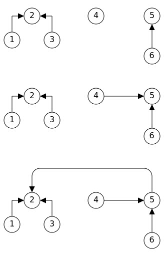

If we have a set of disjoint sets (no two sets contain a common element),
\\(\\{\\{1,2,3\\},\\{4\\},\\{5,6\\},\dots\\}\\) for example. How can we
merge two of those sets given two elements \\(x\\) and \\(y\\)?
A naive way is to first locate which set \\(x\\) and \\(y\\) belongs to.
This can be done in constant time if we use a map \\(m\\) to keep track
of which set each element resides in. If \\(x\\) and \\(y\\) are in the
same set, then we have no extra work to do. Otherwise, move or copy every
element from one set (the smaller one) to the other set, and update \\(m\\)
while moving or copying each element. The complexity of this method will
be \\(O(n)\\) since at most \\(\displaystyle \frac{n}{2}\\) elements will
be moved or copied where \\(n\\) is the total number of elements.

We can do a better job by using the union-find data structure which gives
logarithmic complexity for both `find` and `union` operations. The idea
of this structure is to have one element in each set as the representative
element. Then every other element in the same set will "point" to this
representative element directly, or by following a chain of elements.
For checking if two elements is in the same set, we can simply check to
see if they point to the same representative element. When merging two sets,
all we need to do is to have the representative element of one set point to
the representative element of the other set. Now, using the first three sets
defined in our previous example. If we are given pairs \\((4,6)\\) and
\\((6,1)\\) such that for each pair, we need to merge two sets based on
the two elements in that pair. Then the steps can be illustrated by the
diagram below.



As you can see, after merging all sets into one final set. We have turned
a forest (a disconnected graph of which the components are all trees) into
a tree. Since each time we will merge the smaller set into the bigger one.
Therefore, the length of a chain from any leaf to the root will be \\(O(\log_2{n})\\).

### Implementation

For the sake of simplicity, we assume the \\(n\\) distinct elements are in
the range \\([0,n)\\). Then we can have two arrays `link` and `size` of size
\\(n\\) for storing the path from an element to its representative element
and the size of the set each representative element belongs to.

> __NOTE__:
> To initialize `link` and `size`. If each set only contains a single element,
> then each element will be its own representative element and all sets will
> have size \\(1\\).
> Otherwise, randomly pick a representative element \\(x\\) so that `link[x] = x`.
> Then point each of the other elements \\(y\\) in the set to \\(x\\) as `link[y] = x`.
> `size[i]` will be the size of the \\(i\\)-th set.

```go
func find(x int) int {
        for x != link[x] {
                x = link[x]
        }
        return x
}
```

```go
func unite(x, y int) {
        a, b = find(x), find(y)
        // let `a` be the representative element of the smaller set
        if size[a] > size[b] {
                a, b = b, a
        }
        link[a] = b
        size[b] += size[a]
}
```

To check if two elements are in the same set, we can simply check if `find(x) == find(y)`.
An optimization often used for `find` is to update every element point to the
representative element while walking a chain using recursion. By doing this,
subsequent `find` operations will maintain a near-constant time complexity.

### Usage

There are many use cases for union-find structure. Among all those use cases,
I think the key role it plays when implementing the [Kruskal's algorithm](https://en.wikipedia.org/wiki/Kruskal%27s_algorithm)
is probably what makes it known by most people. For those who don't know,
Kruskal's algorithm is an efficient algorithm for computing the minimum spanning
tree (MST) of a given undirected graph. To be brief, the algorithm first sorts
the edges according to the weight or cost value of each edge. Then it tries
to add each edge (in non-decreasing weight order) into the MST until the nodes
of the graph are all in a single component. An edge will be ignored if adding
it will create a cycle.

To demonstrate the union-find structure in action, let's use it to solve question
[684. Redundant Connection](https://leetcode.com/problems/redundant-connection/)
on LeetCode. I encourage you to try solving the problem yourself before looking
at the answer below.

<details>
<summary>Click to see answer</summary>

```go
func findRedundantConnection(edges [][]int) []int {
	    n := len(edges) // number of nodes
        links := make([]int, n+1)
        sizes := make([]int, n+1)

	    // each node initially represents different components
	    for i := 1; i <= n; i++ {
                    links[i], sizes[i] = i, 1
	    }

	    for _, e := range edges {
                u, v := e[0], e[1]
                x, y := find(u, links), find(v, links)
                if x == y {
	    	            return e // adding this edge will create a cycle
                }
                unite(x, y, links, sizes)
	    }

	    return []int{}
}

// find representative node of `u`
func find(u int, links []int) int {
        for u != links[u] {
                u = links[u]
        }
        return u
}

// unite components represented by nodes `x` and `y`
func unite(x, y int, links, sizes []int) {
        if sizes[x] > sizes[y] {
                x, y = y, x
        }
        // merge smaller component into the bigger one
        links[x] = y
        sizes[y] += sizes[x]
}
```
</details>
