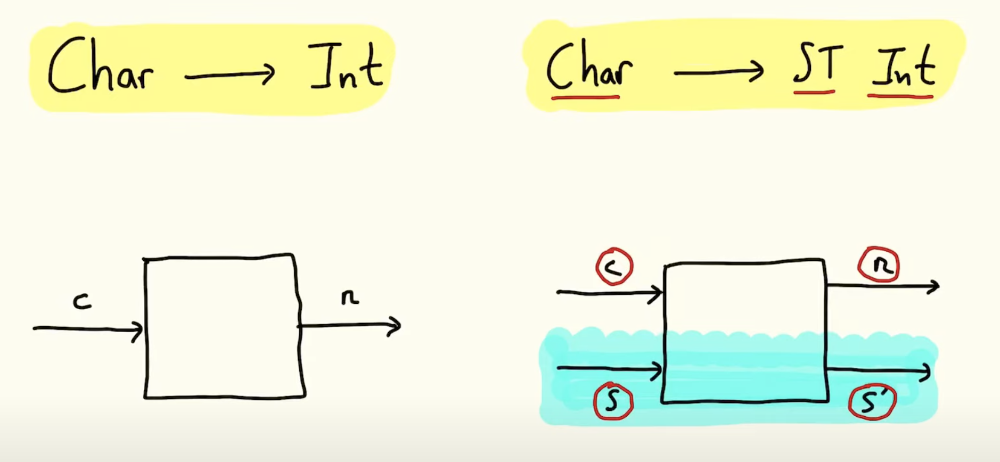

> Disclaimer: Contents below are my own understanding on the topic discussed. They might be correct
> or wrong. Take my words with a grain of salt and feel free to point out the mistakes.

Coming from an Object-Oriented Programming (OOP) background. I still remember the very first time
I was exposed to Functional Programming (FP). My mind was blown after seeing people define small
functions and compose them in different ways to get different results while keeping the code elegant
and easy to read. I had absolutely no idea why things worked together magically. But I felt like it
opened a door to a whole new world in which people reason about programs with a totally different
mental model. After reading the book [Professor Frisby's Mostly Adequate Guide to Functional Programming](https://mostly-adequate.gitbook.io/mostly-adequate-guide/#about-this-book)
by Brian Lonsdorf (a.k.a. Dr Boolean). I got a basic understanding of how things work under the hood
and I started experimenting some of those techniques in the codebase I worked with back then.
It made things deterministic and easy to test when you know all these functions that are used to
compose a new function are _pure_ functions. And I was really happy with the result I achieved using
the knowledge I acquired from another programming paradigm. But still there's one thing that I hear
FP people talk about a lot and I don't quite understand what it is: Monad.

In order to understand Monad, I even took a functional programming course which was taught using
Haskell during my Master's program. Although I was able to complete the assignments when we focused
on the topic of Monad for those ~2 weeks during the semester. But the explanation given by the instructor
still didn't make a light bulb go off in my head. After taking the course, all I know about Monad is
merely that we need to implement the Functor, Applicaive, and Monad interfaces (or typeclasses shown below)
and we can write code using the do-notation. But I still don't know _why_ and _when_ we should make things monadic.

```haskell
class Functor f where
  fmap :: (a -> b) -> f a -> f b


class Functor f => Applicative f where
  pure :: a -> f a
  (<*>) :: f (a -> b) -> f a -> f b


class Applicative m => Monad m where
  return :: a -> m a
  (>>=) :: m a -> (a -> m b) -> m b
```

### Why is Monad useful?

Recently, I've been trying to refresh my memory on parsing algorithms and techniques. Then I remember
that we were implementing a monadic parser for one of the assignments in that Haskell course back in
school. So I decided to give another try to understand Monad. Luckily, this time I found lectures from
professor [Graham Hutton](http://www.cs.nott.ac.uk/~pszgmh/) on Youtube about advanced FP topics in Haskell.
The videos focusing on Monad give some good examples of why and when Monad is needed, and I would say
they are the best videos I've seen explaining Monad. Let's start with _why_ Monad is useful using the
example from the lecture.

Consider that we will be evaluating expressions of divisions between integers. An expression can be
represented by the following recursive data type.

```haskell
data Expr = Val Int
          | Div Expr Expr
```

Then a function to evaluate an expression can be defined like this:

```haskell
eval :: Expr -> Int
eval (Val n) = n
eval (Div e1 e2) = eval e1 `div` eval e2
```

As you can see this function will throw divide-by-zero exception when `eval e2` returns zero.
To represent failure in a pure functional language like Haskell. We need a special type to indicate
something could fail. Haskell has a built-in `Maybe` type (shown below) that can be used in this situation.

```haskell
data Maybe a = Nothing  -- failure with no result
             | Just a   -- success with result `a`
```

Then we can create a safe version of `div` and rewrite our `eval` function like this:

```haskell
safediv :: Int -> Int -> Maybe Int
safediv _ 0 = Nothing
safediv x y = Just (x `div` y)


eval :: Expr -> Maybe Int
eval (Val n) = Just n
eval (Div e1 e2) =
    case eval e1 of
        Nothing -> Nothing
        Just x ->
            case eval e2 of
                Nothing -> Nothing
                Just y -> safediv x y
```

A key notion mentioned in the lecture is that _Monad is about observing common pattern_.
And here the pattern in `eval` is that we have to check the result of `eval` using `case-of` branches
for both sub-expressions of `Div Expr Expr`. Let's extract this common pattern to an infix function
named `>>=`.

```haskell
mx >>= f =
    case mx of
        Nothing -> Nothing
        Just x -> f x
```

So what is the type of `>>=`? We can infer the type based on the implementation.
Because we are matching `mx` against `Nothing` and `Just`, we know `mx` must be a `Maybe` type of
something (i.e. `Maybe a`). Since we are passing the inner value `x` of `Just x` to `f`.
Then we know `f` takes a parameter of the same type as `x`. What should be the result type of `f x`?
Because both case branches must return the same type. Therefore, `f x` is also a `Maybe` type of
something (i.e. `Maybe b` which means it might not contain a inner value of the same type as `x`).
With our analysis, we can finally tell that this function has type `(>>=) :: Maybe a -> (a -> Maybe b) -> Maybe b`.
Let's rewrite our `eval` again using this helper function `>>=`.

```haskell
eval :: Expr -> Maybe Int
eval (Val n) = Just n
eval (Div e1 e2) = eval e1 >>= \x ->
                   eval e2 >>= \y ->
                   safediv x y
```

This can be generalized to any number of parameters as follows:

```
m1 >>= \arg1 ->
m2 >>= \arg2 ->
    .
    .
    .
mn >>= \argn ->
f arg1 arg2 ... argn
```

We will only get our final result if every argument to `f` is obtained successfully. A failure during
the process will terminate the computation early and the whole thing will just evaluate to `Nothing`.
This is similar to propagating an exception in OOP languages like Java using `throw` statement.
In fact, this pattern is common enough so Haskell even has a syntactic sugar for it known as the `do`-notation.

```
do arg1 <- m1
   arg2 <- m2
       .
       .
       .
   argn <- mn
   f arg1 arg2 ... argn
```

Let's rewrite our implementation using the `do`-notation.

```haskell
eval :: Expr -> Maybe Int
eval (Val n) = Just n
eval (Div e1 e2) = do x <- eval e1
                      y <- eval e2
                      safediv x y
```

You probably have already noticed that the function `>>=` defined above has a very similar type as
the `>>=` method defined on typeclass Monad. Actually, `Maybe` type does implement the Monad typeclass
and we can use `>>=` (known as the bind operator) directly without having to define our own implementation.
Try the following in `GHCi` from command line and see if you get same output.

```
$ ghci
λ> Just 10 >>= \n -> Just (n*2)
Just 20
λ> Just 10 >>= \_ -> Nothing >>= \n -> Just (n*2)
Nothing
```

Now we see that Monad can help us "bind" operations together and deal with effects in a pure language.
And we are able to leverage the `do`-notation to improve code readability. The lectures also give
more examples of making other types monadic. Among those examples, I find the state Monad to be a
really good case when Monad should be used.

### Tree labeling

Assume we have the following tree structure. Our task is to assign a unique label to each leaf.

```haskell
data Tree a = Leaf a
            | Node (Tree a) (Tree a)
```

Taking the approach from the lecture, we will use integers as labels. To make sure all labels assigned
are unique, we just need to start from a particular value (e.g. zero), and keep incrementing it
every time we assign the current value to a tree leaf. This can be done easily in an imperative
programming language by mutating a variable while traversing the tree. But values in Haskell are
immutable. Then how can we update the label (or state in general) in a pure functional language?

Basically, what we are trying to achieve is to have a value representing the current _state_, and
another _thing_ to transform the current state into a new state. Since we are using integers as labels.
Then our state would be an integer representing the next available label. This part is straightforward.

```haskell
type State = Int
```

To update our state, we need to find a way to accomplish the same effect given by `State = State + 1`
as in an imperative language. Since we are in the FP world. Then function would naturally be our resort.
We need a function that takes the current state as input. The output would be a pair in which the
first element is a value produced by current state, and the second element is the next state. This
function transforms the state, therefore it's called a state transformer.

```haskell
newtype ST a = S (State -> (a, State))

xfm :: ST Int
xfm = S (\n -> (n, n+1))
```

For people who are familiar with [state machines](https://en.wikipedia.org/wiki/Finite-state_machine),
[Elm architecture](https://guide.elm-lang.org/architecture), or [Redux](https://redux.js.org/introduction/core-concepts).
You can view this state transformer as transition function, update function, or reducer, respectively.
With this state transformer, we are able to define a monadic function `mlabel` to label the leaves
in a tree like this:

```haskell
mlabel :: Tree a -> ST (Tree Int)
mlabel (Leaf _) = do n <- xfm
                     return (Leaf n)
mlabel (Node l r) = do l' <- mlabel l
                       r' <- mlabel r
                       return (Node l' r')
```

Then we can expose a more friendly function `label` (with a helper function `app`) so the callers
who want to label a tree don't need to know what this state transformer is all about.

```haskell
label :: Tree a -> Tree Int
label t = fst $ app (mlabel t) 0

app :: ST a -> State -> (a, State)
app (S f) s = f s
```

If you call the `label` function with a tree now, you will get an error because we are using the
`do`-notation but we still haven't implemented the methods required by those typeclasses to make our
state transformer monadic.  Based on the typeclass signatures above.
A type can be a `Monad` if it's `Applicative`, and a type can be `Applicative` if it's a `Functor`.
So let's make our `ST` an instance of those one by one starting from `Functor`.

`Functor` only requires the `fmap` method to be implemented. From the signature, we know that it will
take a mapping function `(a -> b)`, and a type constructor `f a`, then it will return `f b`. So all
we need to do is extract the `a` from `f a` and pass it to the mapping function to get `b` and put
it back to the same constructor to get `f b`.

```haskell
instance Functor ST where
    fmap f (S st_a) = S (\s -> let (a, s') = st_a s in (f a, s'))
```

`Applicative` needs two methods. `pure` is simple as it takes a value of arbitrary type `a` and we
just need to put it in a constructor (i.e. `ST` in our case). I believe this operation is known as lifting.
The other method is sequential application `<*>`. The function signature looks like `fmap` but be
careful that the first argument has type `f (a -> b)` instead of `(a -> b)`. So the logic would be
similar to `fmap` except we also need to extract `(a -> b)` from `f (a -> b)`.

```haskell
instance Applicative ST where
    pure a = S (\s -> (a, s))
    (ST st_f) <*> (ST st_a) = S (\s -> let (f, s') = st_f s
                                           (a, s'') = st_a s'
                                        in (f a, s''))
```

Finally we can make our state transformer a `Monad` by implementing the `return` and bind (i.e. `>>=`)
methods. `return` simply injects a value into our monadic type so we can use `pure` here as well.
The only thing I want to point out is the second argument of `>>=` has type `(a -> m b)` which means
that it returns a `ST` using the `a` extracted from the first argument `m a`.

> We will use the same helper function `app` defined above again.

```haskell
instance Monad ST where
    return = pure
    (S st_a) >>= f = S (\s -> let (a, s') = st_a s in app (f a) s')
```

Now we have everything set up. Try pass a tree to the `label` function and see if the leaves get
labeled correctly.

```
$ ghci <your_file_name>.hs
λ> label (Node (Node (Leaf 'a') (Leaf 'b')) (Leaf 'c'))
Node (Node (Leaf 0) (Leaf 1)) (Leaf 2)
```

The benefit of this state transformer is that it handles state changes behind the scene. I really
like the way professor Graham Hutton illustrates this mental model in the lecture by drawing pictures
like the one shown below. The types `Char` and `Int` in the function definition tell you the input
and output types. The state management done by our state transformer is completely under the water
so the details won't be visible to the user and they can focus on things they care about.



### Conclusion

Like being emphasized in the lectures. Monad is about recognizing patterns. A pattern then can be
used to define a generalized idea to solve a class of problems which to me is really powerful.
The state transformer mentioned above takes an initial value, then each new state is merely derived
based on the previous state like a generator. But we can definitely enhance it so it can take other
inputs that can be used while computing the next state. I also noticed that there's a `Control.Monad.ST`
library that you can import. I _assume_ it provides a more generalized state management approach so
we don't have to repeat ourselves. Please check out the items listed in references to discover more.


### References

* [Functional Programming in Haskell](https://www.youtube.com/playlist?list=PLF1Z-APd9zK7usPMx3LGMZEHrECUGodd3)
* [Advanced Functional Programming in Haskell](https://www.youtube.com/playlist?list=PLF1Z-APd9zK5uFc8FKr_di9bfsYv8-lbc)
* [What is a Monad?](https://www.youtube.com/watch?v=t1e8gqXLbsU)
* [Monadic Parser Combinators](https://www.cs.nott.ac.uk/~pszgmh/monparsing.pdf)


